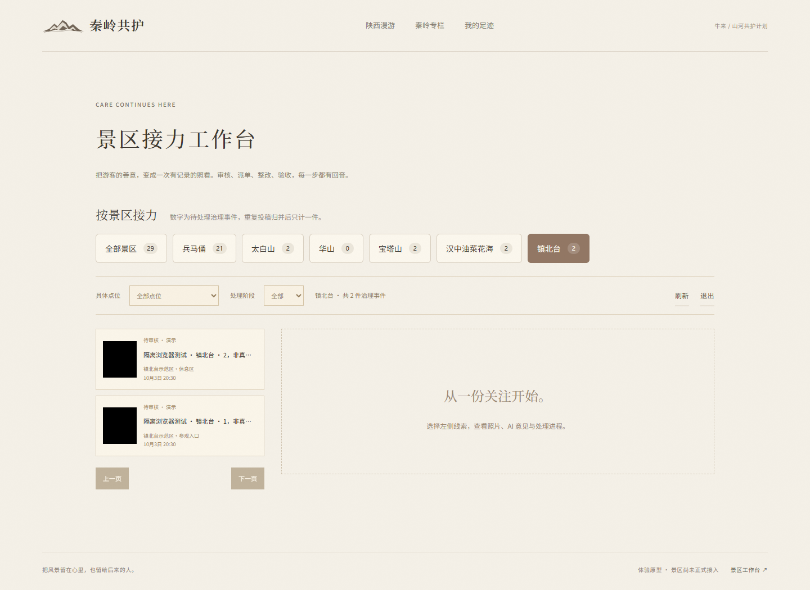
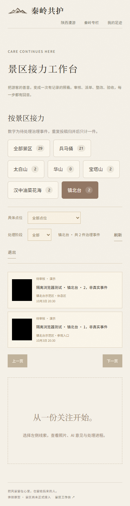

# 管理端按景区接力

日期：2026-10-03。本轮只改管理端队列分类，复用已有六景区配置、暖纸视觉、审核派单与 EcoProof 业务。

## 使用方式

打开 [本机工作台](http://127.0.0.1:8000/#/workbench)，使用本机环境配置中的管理员账号登录。

1. 选择「全部景区 / 兵马俑 / 太白山 / 华山 / 宝塔山 / 汉中油菜花海 / 镇北台」。旁边数字是该景区当前待处理的治理事件数。
2. 「具体点位」只提供该景区已配置的示范点位；「全部景区」下提供全部十二个示范点位。规划点位不能投稿，不作为队列筛选入口。
3. 「处理阶段」可以与景区、点位组合筛选，包括待审核、待补充、处理中、待验收、结案和归档。切换景区保留阶段、重置点位和分页；切换任一筛选或分页清空原详情、说明、责任人与整改照片草稿，避免在旧事件上继续操作。
4. 选择列表事件，继续使用已有照片证据、AI 分析、关联确认/撤销、派单和整改验收。处理后刷新列表与各景区统计。导航数字独立于列表筛选，因此「已结案」列表可以有事件，而景区待处理数字为零。

数字按未归并的主事件统计；四个未结束阶段计入待处理，结案/归档不计入，重复投稿归并后只计一件治理事件。数字不是游客人数。正式与演示主事件都在当前管理队列中，事件卡继续显示演示标识。

## 实现与兼容

- `GET /api/events` 增加可选 `scenic_id`，与既有 `point_id`、`status` 等条件取交集。SQL 先过滤，再计算总数与分页，避免只在已取出的二十条里筛选。
- `overview.points` 增加 `pending_count`；既有 `event_count`、接口路径、访问凭证和数据库结构保留。OpenAPI 与前端类型同步。
- 列表请求和关联详情请求具有版本检查。快速切换后旧 HTTP 请求可以完成，但结果不会覆盖新景区。
- 列表失败显示读取失败和刷新入口；统计失败将数字显示为「—」，不会伪装成零件待办，仍保留已成功读取的事件。
- 景区按钮是原生可聚焦按钮，提供选中状态与待处理数量的无障碍名称；窄屏自动换行，不修改首页地图、景区篇章或游客入口。

## 验证结果

- 后端与 AI 离线测试：`python -m pytest backend/tests backend/tests_ai -q`，96 项通过，其中新增四项验证分页前过滤、条件交集、管理权限和归并/结束事件计数。
- Ruff、TypeScript 与 Vite 构建通过。
- `scripts/admin_scenic_browser.mjs` 使用隔离数据库，通过真实 HTTP 上传并创建明确标注的 31 份测试投稿；验证六景区、点位与阶段、超过二十条的分页、派单/归档后统计、详情清空、延迟响应、接口失败与重试。
- 320、390、768、1440、2048px 五种屏幕宽度下七个导航项可见，无页面横向溢出；无浏览器页面异常。
- 既有 `scripts/browser_smoke.mjs` 完整业务回归通过：陕西地图、六景区投稿/收藏、AI 失败材料保留、补充、派单、整改、人工结案、凭证找回与页面响应式布局。
- 此脚本关闭模型密钥，没有调用真实模型，也未向正式演示数据库添加测试事件。本轮没有修改模型调用链，原真实模型验收记录见 [EcoProof升级验收](EcoProof升级验收.md)。

复现浏览器检查：先完成前端构建，再运行 `node scripts/admin_scenic_browser.mjs`。Windows 本机可设置 `PLAYWRIGHT_CHROMIUM_EXECUTABLE=C:\Program Files\Google\Chrome\Application\chrome.exe`。脚本将隔离库交由系统临时目录保留，截图和结果写入忽略目录 `data/browser-evidence/scenic-admin-*`。

桌面与手机截图均来自本轮隔离测试材料：

