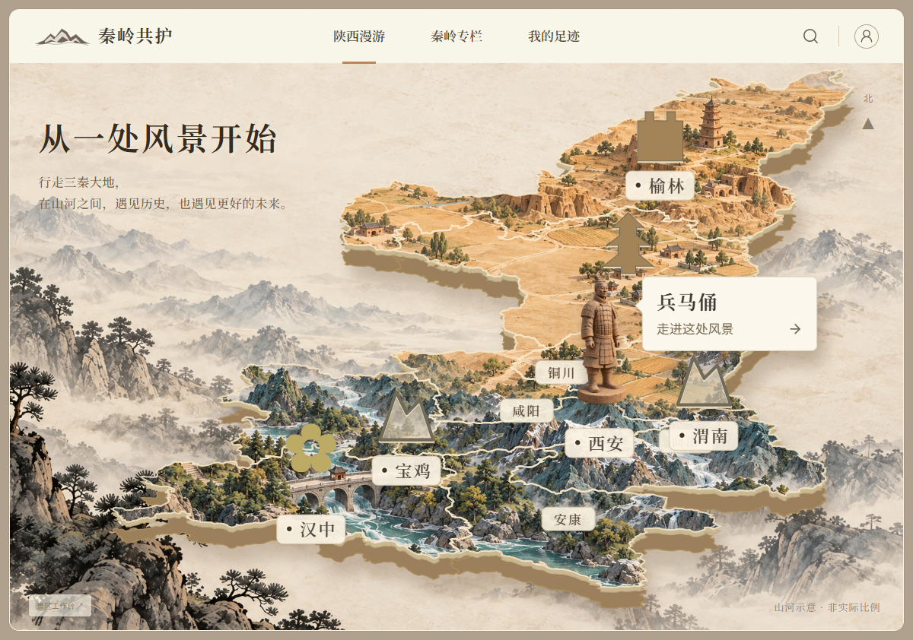

# 首页参考图还原 · 2026-10-03

用户以右侧 UI 示意图为构图依据，要求尽量还原山形标志、中文排版、水墨背景、地图比例与地标提示卡。此次改动聚焦首页，沿用景区入口和处置流程；新的景区地标素材按用户要求暂缓生成。

## 还原内容

- 山形 SVG 标志与“秦岭共护”宋体标题，去掉“共”字印章与副标。
- 中文导航、暖色下划线、可用的景区搜索和“我的足迹”入口。
- 首页标题与说明按参考图：“从一处风景开始”“行走三秦大地，在山河之间，遇见历史，也遇见更好的未来。”
- 去掉首页左侧英文与“一幅山河，许多种相遇。”；移除右侧长便笺和下方数据栏。
- 水墨山水、前景松树、雾层与纸张肌理铺满画面；地图扩大、宽化并上移，加入浅色基座与边界。
- 景区卡片贴在地标旁，现有地标按从北到南排序，兵马俑拥有完整的显示空间。调整延安标签以避免遮住人物头部。
- 手机保持完整山河画卷，导航分两行，搜索可过滤当前两个可操作篇章。

## 验证

TypeScript/Vite 构建通过；真实浏览器闭环通过。补充检查：去除两段旧文案、标题、十市边界、地图宽度大于桌面视口的 60%、搜索过滤、兵马俑头部区域可直接点击且未被其他标签遮住。原上传、收藏、补充、派单、整改、验收和游客读取路径复验通过，手机无横向溢出。隔离测试证据为 data/browser-evidence/1790960340195/。

## 生成资产

使用内置 imagegen 工具，以用户提供的右侧示意图为风格参考；两张资产分别独立生成，未覆盖原有素材。不是把整幅 UI 图当作可点击网页。市级地理边界仍用既有 GeoJSON，地图以艺术视角投影，并标注“山河示意 · 非实际比例”。

### 水墨背景

保存位置：frontend/public/assets/ink-background-v2.png。

最终提示词：

Use case: stylized-concept. Asset type: immersive website background, wide landscape 16:10. The reference image is the approved Shaanxi miniature map UI. Generate ONLY its surrounding ink-wash scenery and warm parchment backdrop, with NO map, NO text, NO logo, NO interface, NO frame. Closely match the reference: soft aged ivory paper with subtle fibers; layers of gray taupe Chinese ink mountains fading into fog, especially at left and lower right; beautifully detailed dark ink pine trees and rock formations entering from bottom-left, subdued fine pine silhouettes toward bottom right; generous luminous cream empty space across center and upper-left for overlaid title and interactive map. Not a blank beige gradient: retain clearly visible authentic Chinese shan-shui watercolor landscape, soft brushwork, quiet mist and depth. Muted stone, dusty beige, light ink gray, delicate restrained earthy green only in remote trees, no bright colors. Keep top 10% light and calm for navigation. Edge-to-edge, no border. This is a production illustration asset, not a screenshot.

### 地图地形纹理

保存位置：frontend/public/assets/atlas-terrain-v2.png。

最终提示词：

Use case: stylized-concept. Asset type: wide rectangular diorama terrain texture that will be clipped into a Shaanxi silhouette by SVG. Match the miniature landscape in the supplied approved UI reference as closely as possible in materials, restrained colors, scene detail and 3D miniature rendering. Generate the landscape only as a full rectangular wide image, no map silhouette, no exposed exterior platform border. Orientation north at top: northern upper half muted golden loess hills, earthen ancient architecture and terraces; center quiet warm sandy Guanzhong plain with a few historic roofs and winding footpaths; southern bottom third deep dusty blue-gray Qinling ranges, pale snow caps, miniature pines, winding rivers and a modest stone bridge. Three-dimensional miniature carved terrain, coherent shallow 35-degree overhead view, large readable hills and buildings, softer and less busy than a densely detailed texture. Muted natural ochres, earthy stone, desaturated blue-green south; light from upper left, tactile crafted landscape, soft ambient shadow. Do NOT put terracotta warriors, landmark hero icons, map pins, labels, UI, text, logos or compass into this asset. Keep center plain spacious for an interactive warrior added separately. Render landscape wide 3:2, cover whole frame, no transparency.

山形品牌标志直接以 SVG 实现，适合随界面缩放；没有另行生成地图上的景区图标。

